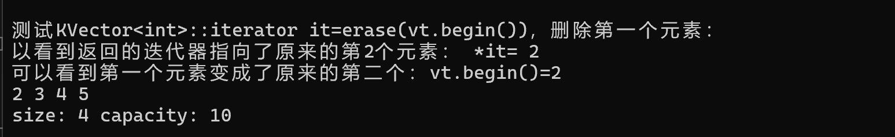

# KVector项目

## 实现的功能

- [x] **构造函数：** 实现默认构造函数和带有初始大小或初始值的构造函数；
- [x] **析构函数：** 释放动态分配的内存，以避免内存泄漏；
- [x] **添加元素： ** 实现push_back函数，用于将元素添加到数组的未尾，需要考虑数组空间不足时的自动扩展；
- [x] **访问元素：** 提供[]运算符重载和 at()函数，以便可以通过索引访问数组中的元素；
- [x] **获取大小：** 提供一个函数来返回数组的当前大小；
- [x] **判空：** 提供一个函数来检查数组是否为空；
- [x] **清空数组：** 提供一个函数来清空数组中的所有元素；
- [x] **删除元素：** 实现 earse 函数，用于删除数组中指定位置的元素；
- [x] **插入元素：** 实现insert 函数，用于在指定位置插入新元素。

- [x] **迭代器支持：** 实现迭代器，以便可以使用类似于STL的循环语法来遍历数组；
- [x] **移动语义支持：** 实现移动构造函数和移动赋值运算符，以提高性能；
- [x] **自动缩小容量：** 在适当的情况下，可以实现自动缩小容量以节省内存（这里我设置的是删除元素时，如果容量大于元素个数的3倍，就把容量设置为删除后元素个数的1.5倍）；
- [x] **异常安全性：** 考虑在内存分配失败或者其他异常情况下保持容器的一致性；
- [ ] **自定义分配器：** 允许用户指定自定义的内存分配器——这里暂时无头绪，我使用了C++标准库提供的默认内存分配器std::allocator。

- [x] std::initializer_list，C++11新特性，可以传递一组参数来初始化对象
- [x] 拷贝构造函数
- [x] 拷贝赋值运算符
- [x] front()：访问第一个元素
- [x] back()：访问最后一个元素
- [x] data()：提供对底层数组的直接访问
- [x] reserve()：请求改变容器容量
- [x] capacity()：返回容器当前的容量
- [x] shrink_to_fit()：减少容量以节省空间
- [x] pop_back()：移除最后一个元素
- [x] swap()：与另一个vector交换内容
- [x] begin(), end(), cbegin(), cend()，实现正向迭代器
- [x] rbegin(), rend(), crbegin(), crend(), 实现反向迭代器

## 技术亮点

1）**模板编程**：使用模板类`template <typename T>`来允许`KVector`以任意数据类型`T`作为元素，增加了代码的复用性和灵活性；

2）**动态内存管理**：通过`std::allocator<T>`管理动态内存，使用`allocate`分配内存，`construct`构造对象，`destroy`析构对象，最后使用`deallocate`释放内存；

3）**资源管理（RAII）**：构造函数中分配资源，析构函数中释放资源，遵循了RAII(Resource Acquisition Is Initialization) 原则，确保使用资源的对象在生命周期结束时能自动释放其占用的资源；

4）**迭代器支持**：提供了正向迭代器和反向迭代器（`iterator`, `const_iterator`, `reverse_iterator`, `const_reverse_iterator`），使`KVector`能够支持范围for循环和标准算法库中的算法；

5）**拷贝控制**：实现了拷贝构造函数和拷贝赋值运算符，支持深拷贝，保证了对象间的值传递不会相互影响；

6）**移动语义 (std::move)**：在 `push_back`, `expandDoubleCapacity`,和 `assignCapacity` 方法中使用，它显式地将对象转为右值引用，以便使用移动语义而非拷贝；

7）**异常安全性**：`swap`方法标记为`noexcept`，确保在异常安全编码中的可用性；

8）**容量管理**：实现了`reserve`和`shrink_to_fit`方法来显式管理容器的容量，以达到更高效地分配内存和减少不必要的内存使用的目的；

9）**std::initializer_list**：支持列表初始化，使得可以用花括号`{}`初始化`KVector`对象，提高了代码的易用性和可读性。

10）**基于范围的 for循环**：简化了对容器元素的遍历；

11）**迭代器失效处理**：在容器改变时（如扩容、清空等操作），正确处理迭代器和指针的失效问题，确保安全访问容器内的元素。

12）**异常安全**：通过在某些方法（如 `at`）中抛出异常来处理边界情况，增强了容器的健壮性；

13）**自管理容量和大小**：类似于 `std::vector`，`KVector` 实现了动态容量管理，包括自动扩容和提供了 `shrink_to_fit` 和 `reserve` 方法来调整容量。

## 关键代码详细解释

### 构造函数

构造函数共有三个，这里举例关键的两个。

**默认构造函数**

默认构造函数中，我先分配了足够存放capacity个T类型对象的空间（这里的默认capacity是5），但是我不在这些空间上面构造对象，同时领m_data和m_end指向这块空间的起始位置。

```cpp
template<typename T>
KVector<T>::KVector(size_t capacity)
{
	this->m_capacity = capacity;
	this->m_data = this->m_alloc.allocate(capacity);	// 分配空间
	this->m_end = this->m_data;
}
```


**带初始值的构造函数**

与默认构造函数不同的是，我分配空间后还将初始值插入到了我的这块空间中。

```cpp
template<typename T>
KVector<T>::KVector(std::initializer_list<T> list)
{
	this->m_capacity = list.size();
	this->m_data = this->m_alloc.allocate(this->m_capacity);
	this->m_end = this->m_data;
	for (const auto& item : list)
	{
		this->push_back(item);
	}
}
```

插入数据的函数如下所示。

### 插入数据

插入数据主要有两个：一是在尾部插入（对应push_back函数），另一个是在指定位置插入（对应insert函数）

**push_back**

这个插入数据的逻辑就是先判断容量是否充足，如果此时的容量恰好用完，就进行2倍扩容。插入的过程也就是在我的内存分配器所分配的空间上面构造对象的过程。由于尾指针始终是指向最后一个元素的下一个位置，因此是m_end++；

2倍扩容我写成了保护成员函数，因为不需要暴露给用户使用。

```cpp
template<typename T>
void KVector<T>::push_back(const T& value)
{
	if (this->size() == this->capacity())
		this->expandDoubleCapacity();	// 2倍扩容
	this->m_alloc.construct(this->m_end++, value);
}
```

**insert**

这个函数代码如下所示，需要注意的地方就是，插入之前需要先判断当前容量是否用完，用完了则进行2倍扩容再进行插入。

如果插入的位置如果是在末尾，则类似于push_back函数，直接插入即可；

如果插入的位置不在末尾，那么就需要另插入位置后面的数据统一往后面移动一位，这里使用了移动语义`std::move`，进行对象资源所有权的“转移”，而不是传统的“复制”操作。但是转移后原来的对象就会处于不确定的状态，因此，我在移动后将插入新数据位置的原来的对象进行了销毁操作，销毁完毕再利用新数据构造新对象进行插入。

返回值是指向新插入元素的迭代器。

```cpp
template<typename T>
typename KVector<T>::iterator KVector<T>::insert(iterator pos, const T& value)
{
	if (pos >= this->m_data && pos <= this->m_end)
	{
		// 如果size()==capacity()，则进行二倍扩容
		if (this->capacity() == this->size())
			this->expandDoubleCapacity();
		if (pos == this->m_end)
		{
			// 如果刚好在结尾插入，就不用移动了
			this->m_alloc.construct(this->m_end, value);
		}
		else
		{
			std::move(pos, this->m_end, pos + 1);
			// 先销毁原来的对象，因为现在是不确定的状态
			this->m_alloc.destroy(pos);
			// 销毁完毕再插入新元素
			this->m_alloc.construct(pos, value);
		}
		this->m_end++;
		return pos;
	}
	return nullptr;
}
```

### 析构函数

析构函数干的事情就是回收资源，也就是我的内存分配器所分配的那块内存空间。

我先销毁这块内存空间上的所有对象，然后再释放这块内存空间，领头指针和尾指针都指向nullpt，避免产生野指针，产生未定义的行为。

```cpp
template<typename T>
KVector<T>::~KVector()
{
	for (size_t i = 0; i < this->size(); i++)
	{
		this->m_alloc.destroy(this->m_data + i);
	}
	this->m_alloc.deallocate(this->m_data, this->m_capacity);
	this->m_data = nullptr;
	this->m_end = nullptr;
}
```

### 扩容
扩容，也就是重新分配容量，具体细节我设置成了保护成员函数，目的就是防止外部调用，外部调用的`reserve(szie_t cap)`函数内部实现就是利用这块部分。

我实现了两个扩容函数，分别是2倍扩容和扩容至指定的大小（当然要大于元素数量）。

**2倍扩容**

首先要先判断当前容量是否为0，因为为0的话，0的二倍还是0，就扩了个寂寞。同时设置capZero为true，这个标识是为了后面释放原来的空间，因为如果原来的容量为0，我手动设置了容量为1，释放原来的内存空间的时候就会多释放了一个，导致内存泄漏或者其他内存错误。

扩容的逻辑就是：分配新空间==>将原来对象的资源所有权转移到新空间==>销毁原来的对象==>释放原来分配的空间==>领首尾指针指向新空间，同时更新容量。

```cpp
template<typename T>
void KVector<T>::expandDoubleCapacity()
{
	bool capZero = false;
	if (this->m_capacity == 0)
	{
		this->m_capacity = 1;	// 如果容量为0，先初始化为1
		capZero = true;
	}
	// 分配新空间，大小为原来的2倍
	T* newData = this->m_alloc.allocate(this->m_capacity * 2);
	T* newEnd = newData;
	for (size_t i = 0; i < this->size(); i++)
	{
		// 移动元素到新空间
		this->m_alloc.construct(newEnd++, std::move(*(this->m_data + i)));
	}
	for (size_t i = 0; i < this->size(); i++)
	{
		this->m_alloc.destroy(this->m_data + i);	// 销毁原来空间上的对象
	}
    // 释放原来空间内存
	if (capZero)
		// 因为如果最开始容量为0时，人为的将容量扩展了，这里需要释放原来的
		this->m_alloc.deallocate(this->m_data, 0);
	else
		this->m_alloc.deallocate(this->m_data, this->m_capacity);
    // 另m_data和m_end指向新的空间
	this->m_data = newData;
	this->m_end = newEnd;
	this->m_capacity *= 2;
}
```

**扩容至指定的大小**

逻辑与2倍扩容相似，区别是扩容的大小是手动指定的，而且不需要判断容量是否为0，以为我调用此函数的时候容量一定不为0。

```cpp
template<typename T>
void KVector<T>::assignCapacity(size_t cap)
{
	// 申请新空间，大小为cap
	T* newData = this->m_alloc.allocate(cap);
	T* newEnd = newData;
	for (size_t i = 0; i < this->size(); i++)
	{
		// 移动原来的数据到新空间
		this->m_alloc.construct(newEnd++, std::move(*(this->m_data + i)));
	}
	for (size_t i = 0; i < this->size(); i++)
	{
		// 销毁原来的对象
		this->m_alloc.destroy(this->m_data + i);
	}
	// 释放内存
	this->m_alloc.deallocate(this->m_data, this->m_capacity);
	this->m_data = newData;
	this->m_end = newEnd;
	this->m_capacity = cap;
}
```

### 释放多余空间
这里做的内容主要有两个，一个是实现std::vector的shrink_to_fit函数，一个是实现当容量超过数据量太多的时候自动将容量变更为数据量的1.5倍，实现的原理主要依赖于上面的 **扩容** 函数。

**shrink_to_fit**

这个函数的目的是将容量收缩到数据量的大小，收缩之后再插入新数据就需要进行2倍扩容，这个函数一般是与clear函数（清空元素，但是不改变容量）一起使用。

```cpp
template<typename T>
void KVector<T>::shrink_to_fit()
{
	if (this->capacity() <= this->size())
		return;
	this->assignCapacity(this->size());
}
```

**自动收缩空间至数据量的1.5倍**

这个技术在删除数据的时候会用到，例如pop_back和erase函数中。判断逻辑就是当删除元素后的数据量小于容量的三倍时，自动扩容至数据量的1.5倍，这里用pop_back函数举例：

```cpp
template<typename T>
void KVector<T>::pop_back()
{
	if (this->size())
	{
		this->m_alloc.destroy(--this->m_end);
		// 如果容量大于size的三倍，则减少容量到size的1.5倍
		if (this->size() * 3 < this->capacity())
			this->assignCapacity(int(this->size() * 1.5));
	}
}
```

### 迭代器
实现的迭代器有：正向迭代器、常量型的正向迭代器、反向迭代器、常量型的反向迭代器。

**正向迭代器**

我这里定义的迭代器接口原理是利用using关键字，给指向T类型的指针取个新名字，包括常量指针，然后通过不同的接口返回不同的地址。

```cpp
using iterator = T*;
using const_iterator = const T*;
iterator begin() { return m_data; }	// 返回指向第一个元素的迭代器
iterator end() { return m_end; }	// 返回指向容器末尾的迭代器
const_iterator begin() const { return m_data; };	// 常量迭代器，指向第一个元素
const_iterator end() const { return m_end; };	// 常量迭代器，指向容器末尾
const_iterator cbegin() const { return m_data; };	// 常量迭代器，指向第一个元素
const_iterator cend() const { return m_end; };	// 常量迭代器，指向容器末尾
```

**反向迭代器**

反向迭代器的实现我使用了C++标准库中的`std::reverse_iterator`，对已定义的 `iterator` 和 `const_iterator` 进行封装。

`std::reverse_iterator<T>` 可以接收一个正向迭代器T，然后提供反向遍历T的能力，并且由于其构造函数中会自动递减一次传入的迭代器，因此通过配置返回的地址，可以达到和std::vector中反向迭代器同样的效果。

```cpp
using reverse_iterator = std::reverse_iterator<iterator>;
using const_reverse_iterator = std::reverse_iterator<const_iterator>;
// 反向迭代器，指向最后一个元素
reverse_iterator rbegin() { return reverse_iterator(m_end); }
// 反向迭代器，指向第一个元素前的位置
reverse_iterator rend() { return reverse_iterator(begin()); }
// 反向迭代器，指向最后一个元素
const_reverse_iterator crbegin() const { return const_reverse_iterator(m_end); }
// 反向迭代器，指向第一个元素前的位置
const_reverse_iterator crend() const { return const_reverse_iterator(begin()); }
```

### 拷贝构造函数

拷贝构造函数的逻辑是先分配一段大小为被拷贝的对象的容量的内存空间，然后利用C++标准库中的`std::uninitialized_copy`把被拷贝的数据复制到新分配的内存空间中，之所以使用这个函数，是因为我们分配的新空间还未初始化，还没有在这块空间上面构造对象。返回值是复制之后的最后一个数据的下一个位置。

如果是在已经初始化的内存空间中复制数据，则用std::copy更合适。

```cpp
template<typename T>
KVector<T>::KVector(const KVector& KV)
{
	this->m_data = this->m_alloc.allocate(KV.capacity());
	// std::uninitialized_copy：在原始内存中直接构造对象，（左闭右开）
	this->m_end = std::uninitialized_copy(KV.m_data, KV.m_end, this->m_data);
	this->m_capacity = KV.capacity();
}
```

### 两个KVector交换数据

这里的swap函数的实现原理是使用了位于`<utility>`头文件中的swap函数，交换两个自定义Vector的头指针和尾指针指向的位置以及他们的容量。

noexcept可以保证该函数不会抛出异常，保证了拷贝赋值运算符中调用swap函数时的异常安全性。

```cpp
template<typename T>
void KVector<T>::swap(KVector& KV) noexcept
{
	// 确保如果命名空间中存在针对当前类型的 swap 函数，则优先使用
	using std::swap;
	swap(this->m_data, KV.m_data);
	swap(this->m_end, KV.m_end);
	swap(this->m_capacity, KV.m_capacity);
}
```

### 拷贝赋值运算符

这里就利用了上面的swap函数，和拷贝构造函数。

首先创建一个临时的KVector对象temp，再利用拷贝构造函数将KV的值通过深拷贝复制给temp，然后再利用上面定义的swap函数将当前对象的值和temp做交换，最后返回当前对象的引用。

这里利用了一种叫做 **Copy-and-Swap** 的技巧，保证了异常安全性、代码可重用性以及提供了自动资源管理。

```cpp
template<typename T>
KVector<T>& KVector<T>::operator=(const KVector& KV)
{
	KVector temp(KV);
	this->swap(temp);
	return *this;
}
```

### 删除指定（范围）数据
我实现了两种函数，一种是删除指定的单个元素，另一种是删除指定范围内的元素。

**删除指定的单个元素**

这个相比 **删除指定范围内的元素** 简单多了，只需要先析构被删除的对象，然后再将后面的元素往前移动一个位置即可，同时销毁在移动之前处于最后位置的对象（因为该位置的资源所有权会被移动给前面的对象，该位置的对象就是处于一种不确定的状态，并且为了后续能够正常插入新数据，此对象需要进行销毁）。

另外，如果删除后的数据容量大于数据量的三倍，则自动收缩容量至数据量的1.5倍，最后返回指向被删除位置的迭代器（此时已经指向了被删除元素的下一个元素）。

这里不需要判断删除的是否为最后一个元素，因为即使删除的是最后一个元素，pos+1和m_end相等，std::move函数也不会移动任何数据。

```cpp
template<typename T>
typename KVector<T>::iterator KVector<T>::erase(iterator pos)
{
	if (pos >= this->begin() && pos < this->m_end)
	{
		// 先销毁被删除的对象
		this->m_alloc.destroy(pos);
		// 元素前移, move函数移动区间左闭右开
		std::move(pos + 1, this->m_end, pos);
		// 销毁最后的对象
		this->m_alloc.destroy(--this->m_end);
		// 如果容量大于size的三倍，则减少容量到size的1.5倍
		if (this->size() * 3 < this->capacity())
			this->assignCapacity(int(this->size() * 1.5));
		return pos;
	}
	return nullptr;
}
```

**删除指定范围内的元素**

这个要稍微复杂一些，因为需要判断删除元素后需要移动多少个位置。参考std::vector，这个函数删除元素的区间也是左闭右开的，也就是只会删除到右边界的上一个元素，所以这里的第一个if语句中写了`end <= this->m_end`而不是`end < this->m_end`。

首先，也是要先销毁要删除区间内的对象，销毁完毕后判断一下是否删除到了最后一个元素，因为如果删除到了最后一个元素，就不需要再执行move将后面的元素往前移动了。

如果删除区间内不包含最后一个元素，那么就需要在删除后将后面的元素对象向前移动，移动到删除区间的第一个位置。但是需要注意的是，移动后会在后面出现很多状态不确定的对象，因为它们的资源所有权被往前转移给其他对象了，这些对象需要被销毁，那么需要销毁几个对象才行呢？这也是前面提到的复杂之处。

通过计算得知，通过std::move后，后面需要销毁的对象的起始位置是：m_end-(end-start)=m_end-end+start（start是erase函数的第一个参数，表示要删除对象的起始位置，end是第二个参数，表示要删除的最后一个对象的下一个位置）。

那么就好办了，销毁后面的不确定状态的对象后，再把m_end设置为移动后的最后一个对象的下一个位置，也就是m_end-end+start即可。

同样的，如果删除元素后的数据容量大于数据量的三倍，则自动收缩容量至数据量的1.5倍，最后返回指向被删除的第一个元素的迭代器。

```cpp
template<typename T>
typename KVector<T>::iterator KVector<T>::erase(iterator start, iterator end)
{
	if (start <= end && start >= this->m_data && end <= this->m_end)
	{
		// 先销毁区间内的对象
		for (iterator it = start; it < end; it++)
		{
			this->m_alloc.destroy(it);
		}
		// 如果要删除的最后一个元素刚好是最后一个对象，就不用往前move了
		if (end == this->m_end)
		{
			this->m_end = start;
		}
		else
		{
			std::move(end, this->m_end, start);
			// 销毁往前move之后结尾空出来的元素
			for (iterator it = this->m_end - end + start; it < this->m_end; it++)
			{
				this->m_alloc.destroy(it);
			}
			// 设置尾指针的位置
			this->m_end = this->m_end - end + start;
		}
		// 如果容量大于size的三倍，则减少容量到size的1.5倍
		if (this->size() * 3 < this->capacity())
			this->assignCapacity(int(this->size() * 1.5));
		return start;
	}
	return nullptr;
}
```

## 演示结果

**测试代码文件为kvectortest.cpp**

**下面是测试的效果展示**

1、首先，调用默认的构造函数，默认申请5个空间，此时元素数量为0，容量为5

```cpp
KVector<int> vt;
std::cout << "使用默认构造函数，容器的初始元素个数和容量：" << std::endl;
std::cout << "size: " << vt.size() << " capacity: " << vt.capacity() << std::endl;
```


2、然后插入6个元素，由于容量为5，因此会进行2倍扩容，可以看到插入后的size（也就是元素数量）为6，容量为10

```cpp
int i = 0;
for (i = 0; i < 6; i++)
{
    vt.push_back(i + 1);
}
std::cout << "size: " << vt.size() << " capacity: " << vt.capacity() << std::endl;
```


3、然后测试一下[]符号，下面的代码是可以修改[]中的值的，这里我重载运算符的时候还另外写了不能修改[]值的const版本

```cpp
std::cout << "\n测试[]运算符，遍历vector：" << std::endl;
for (i = 0; i < vt.size(); i++)
{
    std::cout << vt[i] << ' ';
}
```


4、然后测试一下at函数，输出第6个元素（下标为5）

```cpp
std::cout << "\n测试at(5)，输出第6个元素：" << std::endl;
std::cout << vt.at(5) << std::endl;
```


5、at()和[]区别就是使用at()如果访问的位置越界就会抛出异常，测试如下

```cpp
std::cout << "\n测试at(9)的越界访问，输出第10个元素：" << std::endl;
try
{
    std::cout << vt.at(9) << std::endl;
}
catch (const std::exception &e)
{
    std::cerr << "Error: " << e.what() << std::endl;
}
```


6、执行一次pop_back，可以看到，元素个数会减一，但是容量不变，和std::vector一致

```cpp
std::cout << "\n执行一次pop_back：" << std::endl;
vt.pop_back();
std::cout << "size: " << vt.size() << " capacity: " << vt.capacity() << std::endl;
```


7、测试正向和反向迭代器，同样的我也分别写了不可修改其内容的const版本

```cpp
std::cout << "\n测试正向迭代器：" << std::endl;
for (KVector<int>::iterator it = vt.begin(); it != vt.end(); it++)
{
    std::cout << *it << ' ';
}
std::cout << "\n测试反向迭代器：" << std::endl;
for (KVector<int>::reverse_iterator rit = vt.rbegin(); rit != vt.rend(); rit++)
{
    std::cout << *rit << ' ';
}
```


8、测试erase函数，删除第一个元素，也就是把上面遍历结果的1删除，同时我们遍历一下容器，查看其元素个数和容量的变化是符合正常逻辑的

```cpp
std::cout << "\n\n测试KVector<int>::iterator it=erase(vt.begin())，删除第一个元素：" << std::endl;
KVector<int>::iterator it=vt.erase(vt.begin());
std::cout << "以看到返回的迭代器指向了原来的第2个元素：";
std::cout << " *it= " << *it << std::endl;
std::cout << "可以看到第一个元素变成了原来的第二个：vt.begin()=" << *vt.begin() << std::endl;
for (auto it = vt.begin(); it != vt.end(); it++)
{
    std::cout << *it << ' ';
}
std::cout << "\nsize: " << vt.size() << " capacity: " << vt.capacity() << std::endl;

```



9、测试erase函数，删除指定范围内的函数（区间为左闭右开），这里测试删除2和5之间的元素，结果正确

```cpp
std::cout << "\n测试KVector<int>::iterator it=erase(vt.begin()+1,vt.end()-1)，删除首尾之间的元素：" << std::endl;
it=vt.erase(vt.begin()+1,vt.end()-1);
std::cout << "可以看到erase函数返回的是删除的最后一个元素的下一个位置，*it=" << *it << std::endl;
for (auto it = vt.begin(); it != vt.end(); it++)
{
    std::cout << *it << ' ';
}
std::cout << "\nsize: " << vt.size() << " capacity: " << vt.capacity() << std::endl;
```


10、测试front()和back()函数

```cpp
std::cout << "\n测试front和back：" << std::endl;
std::cout << "front:" << vt.front() << " back:" << vt.back() << std::endl;
```


11、测试insert()函数，可以看到函数返回的是指向被插入的元素的迭代器，同时元素个数（也就是size会加1）和std::vector一致

```cpp
std::cout << "\n测试KVector<int>::iterator it=insert(vt.begin(),100): " << std::endl;
it=vt.insert(vt.begin(), 100);
std::cout << "可以看到函数返回的是指向被插入的元素的迭代器，*it=" << *it << std::endl;
for (auto it = vt.begin(); it != vt.end(); it++)
{
    std::cout << *it << ' ';
}
std::cout << "\nsize: " << vt.size() << " capacity: " << vt.capacity() << std::endl;
```


12、测试reverse函数，把容量变成20

```cpp
std::cout << "\n测试reverse，分配20个容量：" << std::endl;
vt.reserve(20);
std::cout << "size: " << vt.size() << " capacity: " << vt.capacity() << std::endl;
```


13、测试自动缩小容量，设置的策略为当删除元素（pop_back、erase等）后当容量大于size的3倍时，收缩至size的1.5倍，在上一步中我们的容量变成了20，大于size的3倍（size为3），因此执行pop_back后的size会变成2，容量会变成3

```cpp
std::cout << "\n测试自动缩小容量，删除元素后当容量大于size的三倍时，收缩至size的1.5倍：" << std::endl;
vt.pop_back();
std::cout << "size: " << vt.size() << " capacity: " << vt.capacity() << std::endl;
```


14、测试一下shrink_to_fit()函数，结果符合预期

```cpp
std::cout << "\n测试shrink_to_fit：" << std::endl;
vt.shrink_to_fit();
std::cout << "size: " << vt.size() << " capacity: " << vt.capacity() << std::endl;
```


15、clear()函数，执行该函数，元素个数会变为0，但是容量是不变的，与std::vector保持一致

```cpp
std::cout << "\n测试clear：" << std::endl;
vt.clear();
std::cout << "size: " << vt.size() << " capacity: " << vt.capacity() << std::endl;
```


16、测试一下构造函数，创建新的KVector<int> vt_2，用{}包含初始参数{100,200,300,400,500}，这里设置的size和容量都是元素的个数，再次插入就会进行2倍扩容

```cpp
std::cout << "\nKVector<int> vt_2={100,200,300,400,500},然后遍历：" << std::endl;
KVector<int> vt_2 = { 100,200,300,400,500 };
for (i = 0; i < vt_2.size(); i++)
{
    std::cout << vt_2[i] << ' ';
}
std::cout << std::endl << "vt2_size: " << vt_2.size() << " vt2_capacity: " << vt_2.capacity() << std::endl;
```


17、测试构造函数，创建新的KVector<int> vt_3，指定大小（7）和初始值（99）

```cpp
std::cout << "\n创建新的KVector<int> vt_3(7, 99),然后遍历：" << std::endl;
KVector<int> vt_3(7, 99);
for (i = 0; i < vt_3.size(); i++)
{
    std::cout << vt_3[i] << ' ';
}
std::cout << std::endl << "vt3_size: " << vt_3.size() << " vt3_capacity: " << vt_3.capacity() << std::endl;
```


18、测试拷贝构造函数，创建新的KVector<int> vt_4(vt_2)，遍历可以看到结果与第“16”步的vt_2的遍历结果一致，这里用的是深拷贝，vt_4和vt_2的数据互不影响

```cpp
std::cout << "\n测试拷贝构造函数，创建新的KVector<int> vt_4(vt_2)然后遍历：" << std::endl;
KVector<int> vt_4(vt_2);
for (i = 0; i < vt_4.size(); i++)
{
    std::cout << vt_4[i] << ' ';
}
std::cout << std::endl << "vt4_size: " << vt_4.size() << " vt4_capacity: " << vt_4.capacity() << std::endl;
```


19、测试拷贝赋值运算符，创建新的KVector<int> vt_5=vt_3，然后遍历，可以看到结果与第“17”步的vt_3相同，这里用的也是深拷贝，vt_5和vt_3的数据互不影响

```cpp
std::cout << "\n测试拷贝赋值运算符，创建新的KVector<int> vt_5=vt_3，然后遍历：" << std::endl;
KVector<int> vt_5=vt_3;
for (i = 0; i < vt_5.size(); i++)
{
    std::cout << vt_5[i] << ' ';
}
std::cout << std::endl << "vt5_size: " << vt_5.size() << " vt5_capacity: " << vt_5.capacity() << std::endl;
```


20、测试swap函数，交换第"18"步创建的vt_4和第“19”步创建的vt_5的数据，然后分别输出，可以看到在执行完毕该函数后，vt_4和vt_5的数据、大小和容量都会发生交换。

```cpp
std::cout << "\n测试swap函数，交换vt_4和vt_5的内容：" << std::endl;
vt_5.swap(vt_4);
std::cout << "交换完毕，输出vt_4的数据和大小、容量：" << std::endl;
for (i = 0; i < vt_4.size(); i++)
{
    std::cout << vt_4[i] << ' ';
}
std::cout << std::endl << "vt4_size: " << vt_4.size() << " vt4_capacity: " << vt_4.capacity() << std::endl;
std::cout << "输出vt_5交换后的数据和大小、容量：" << std::endl;
for (i = 0; i < vt_5.size(); i++)
{
    std::cout << vt_5[i] << ' ';
}
std::cout << std::endl << "vt5_size: " << vt_5.size() << " vt5_capacity: " << vt_5.capacity() << std::endl;
```


**本项目还有很多可以补充优化之处，欢迎补充~**
